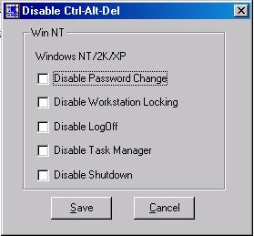



## Disable Ctrl\-Alt\-Del in Win9x and Win NT/2K/XP  too

### Description

The following code will demonstrate how to disable Ctrl-Alt-del in Win 9x platform, and how to disable various options in the Ctrl-Alt-Del List in Win NT/2K/XP. To understand the code, you must know how to use the Api functions, although I have tried to keep all the api's in seperate classes.

There is also a class which determines if the OS is from Win9x or Win NT series.

Hope you would fine some use for it.
 
### More Info
 
This function uses api calls for disbaling in Win 9x and registry api functions to disable in Win NT/XP/2K.

If you are working in Win NT/2K/XP, it will be safe to create a new user for testing purposes.

             |
---                |---
**Submitted On**   |2002-08-21 13:32:44
**By**             |[Amitabh Kant](https://github.com/Planet-Source-Code/PSCIndex/blob/master/ByAuthor/amitabh-kant.md)
**Level**          |Intermediate
**User Rating**    |4.9 (59 globes from 12 users)
**Compatibility**  |VB 5\.0, VB 6\.0
**Category**       |[Windows System Services](https://github.com/Planet-Source-Code/PSCIndex/blob/master/ByCategory/windows-system-services__1-35.md)
**World**          |[Visual Basic](https://github.com/Planet-Source-Code/PSCIndex/blob/master/ByWorld/visual-basic.md)
**Archive File**   |[Disable\_Ct1205698212002\.zip](https://github.com/Planet-Source-Code/amitabh-kant-disable-ctrl-alt-del-in-win9x-and-win-nt-2k-xp-too__1-38136/archive/master.zip)

